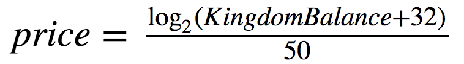
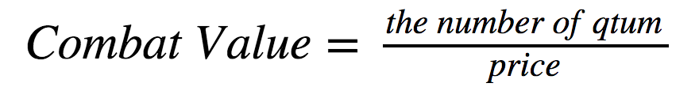

# 游戏简介（以太坊版）
## 游戏背景：
大江东去，浪淘尽，千古风流人物。故垒西边，人道是：三国周郎赤壁。乱石穿空，惊涛拍岸，卷起千堆雪。江山如画，一时多少豪杰。
遥想公瑾当年，小乔初嫁了，雄姿英发。羽扇纶巾，谈笑间樯橹灰飞烟灭。故国神游，多情应笑我，早生华发。人生如梦，一尊还酹江月。
话说天下大势，分久必合，合久必分。周末七国分争，并入于秦。及秦灭之后，楚、汉分争，又并入于汉。汉朝自高祖斩白蛇而起义，一统天下，后来光武中兴，传至献帝，遂分为三国。刘备乃汉室皇叔，偏安蜀川。曹操一统北方，功封魏王。孙权传父兄之基业，世守吴地。三国鼎足而立于天下。虽互有攻伐，也只在一城一地之间。其因当魏欲吞并蜀时，吴蜀定会同仇敌忾，共抗魏军。魏势无法吃掉任何一国，只得罢兵。

## 游戏细节：
1. 战斗力价格price：战斗力价格随着各国接受的资金的增加而增加，相同资金越早投资将获得越多战斗值。例如:当初始总战斗力为0时，price为0.01，当战斗力为1024的时候，price为0.011。KingdomBalance为国家收到的总战斗力数量。price计算公式为：

 

2. 战斗值：每位投资者投资的ETH会按照一定比例转换为支持国家的战斗值，投资者投资的最少金额为0.01个eth，公式为:

 

3. 国家总战斗值：每个国家的投资者投资的总战斗值，各国战斗力随着投资者投入Token数量的增加而增加。
 
4. 胜负条件：三国之间相互制衡，弱者联合。如果三个国家分别是A，B和C，假定A为战斗值最高的国家，如果A\>B+C，则A国家的投资者获胜；如果A\<B+C,则B，C两个国家的投资者获胜。所以并不是最强的一方会获胜，去博弈吧。
 
5. 奖金池：以太坊上，每位投资者投资金额的85%将会进入奖金池，剩下的15%将会作为网站维护费用和奖励金的gas消耗。
  
6. 游戏结束条件：初始倒计时5760个block，约为24个小时，当有人进行支持的时候，倒计时增加4个block，但是倒计时不会超过5760个block。注意：时间根据区块间隔计算。

7. 奖励：如果投资者支持的国家获胜，奖金池将会按照投资比例将奖金分给获胜的投资者，投资比例计算公式为：

## 操作指南：
1. metamask安装，下载chrome浏览器，翻墙，安装metamask钱包，创建钱包或者从imtoken导入钱包，充值以太坊，请确保钱包有少量以太坊作为智能合约操作的手续费。
2. 登陆 contract.games，选择你支持的国家，输入你要投资的token的数量（请注意token和战斗值的转换关系，并且越早进入的可兑换的战斗值越高），点击确认按钮，将会弹出metamask钱包框，您可以选择加高gas值以确保您的代币转移被打包，然后点击submit以完成对国家的支持。您可以在主页上随时关注战斗力差距（请注意胜负逻辑）以选择您的支持。
