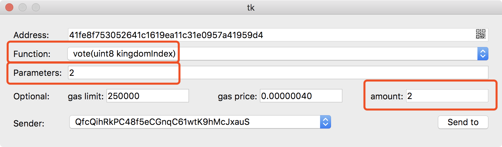

# Game introduction (Qtum)

## Game background：
East flows the mighty river, Sweeping away the heroes of time past; This ancient rampart on its western shore; Is Zhou Yu's Red; Cliff of three Kingdoms' fame; Here jagged boulders pound the clouds, Huge waves tear banks apart, And foam piles up a thousand drifts of snow; A scene fair as a painting, Countless the brave men here in time gone by!
I dream of Marshal Zhou Yu in his day; With his new bride, the Lord Qiao's younger daughter, Dashing and debonair, Silk-capped, with feather fan, He laughed and jested; While the dread enemy fleet was burned to ashes! In fancy through those scenes of old I range. My heart overflowing, surely a figure of fun. A man gray before his time. Ah, this life is a dream, Let me drink to the moon on the river!
Domains under heaven, after a long period of division, tends to unite; after a long period of union, tends to divide. This has been so since antiquity. When the rule of the Zhou Dynasty weakened, seven contending kingdoms sprang up, warring one with another until the kingdom of Qin prevailed and possessed the empire. But when Qin's destiny had been fulfilled, arose two opposing kingdoms, Chu and Han, to fight for the mastery. And Han was the victor.
the rise of the fortunes of Han began when Liu Bang the ancestor slew a white serpent to raise the banners of uprising, which only ended when the whole empire belonged to Han. This magnificent heritage was handed down in successive Han emperors for two hundred years, till the rebellion of Wang Mang caused a disruption. But soon Liu Xiu the Latter Han Founder restored the empire, and Han emperors continued their rule for another two hundred years till the days of Emperor Xian, which were doomed to see the beginning of the empire's division into three parts, known to history as The Three Kingdoms. Liu Bei, the load of Shu, is the uncle of the Han Emperor Xian. Cao Cao unified the north and was lorded the Wei. Sun Quan inherited on the foundation of his father and brother. Although they have attacked each other, they are only between one city and one land. When Wei wants to swallow Shu, Wu will definitely fight against the enemy and fight against Wei's army. Wei potential could not merged any country and had to stop.

## Game detail：

1. Price: The price increases as the increase of funds accepted by countries. The earlier the same funds are invested, the more combat value will be obtained. For example, if the kingdomBalanceToken is 0, then price is 0.1, and if kingdomBalanceToken is 1024, then price will be 0.11. KingdomBalance is the total amount of QTUM received by the country.The formula is:

2. Combat value: Each QTUM invested by each investor will be converted to the country's combat value according to a certain proportion. The minimum amount of investor investment is 0.1 QTUM. The formula is:

3. National Total Combat Value: The total combat value invested by investors in each country. The more tokens investors invest, the more total combat value the country has.

4. Win or lose: The three countries balance each other and the weak are united. If the three countries are A, B and C respectively, assuming A is the country with the highest combat value, if A\>B+C, then the investor of country A wins; if A\<B+C, then the investor of country B and C wins. So not the strongest side will win. Let's play a game.

5. Bonus Pool: on Qtum, 90% of the investment amount of each investor will be put in the bonus pool, and the remaining 10% will be used as the website maintenance fee and the gas consumption.

6. Condition of game over: The initial time is 600 block, about 24 hours. When someone supporting, the countdown increased by 1 block, but the countdown would not exceed 600 block. Note: the time is calculated according to the block interval.

7. Reward: If a investor wins, the prize pool will distribute the bonus to the winning investor according to the investment ratio.

## Vote for the country you support

### Qtum core wallet
Download [Qtum core wallet](https://github.com/qtumproject/qtum/releases).After setup is complete,click the Send To button on the left side of the wallet under the Smart Contracts and input these information:
1. the contract [address](http://contract.games) of the Three Kingdoms
2. the ABI of the contract
3. call the vote function to vote for the country you support
4. which country you are fighting for(0,1,2)
5. input how many tokens you want to vote
6. input voter's address 

### Qtum Electrum (SPV of Qtum)
Download the latest version of [Qtum Electrum](https://github.com/qtumproject/qtum-electrum/releases).For details, see the following figures:

## If you won this game,you will get reward.
the reward will be sent to each voter's wallet address a few minutes after the end of the game

